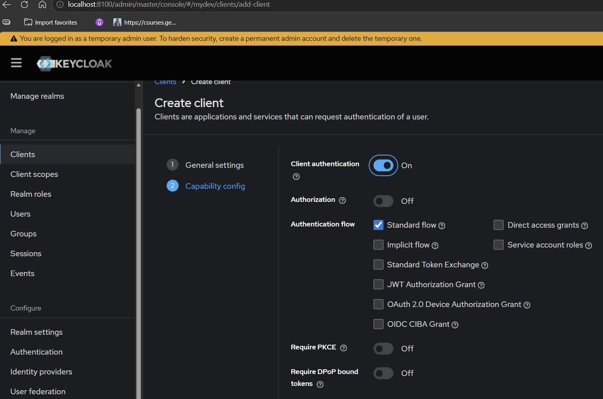
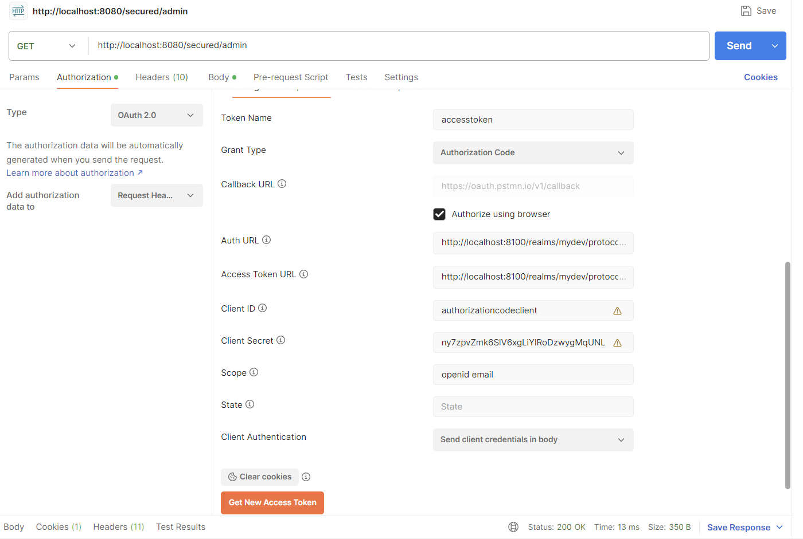
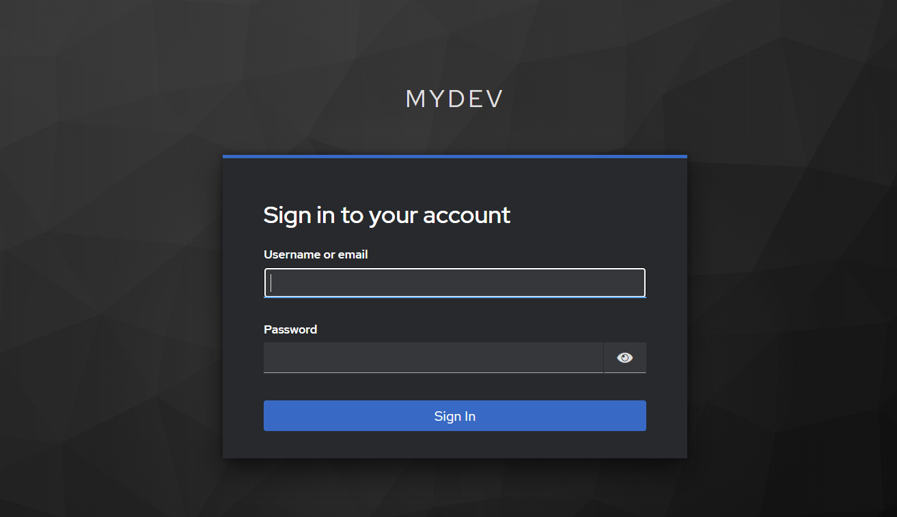
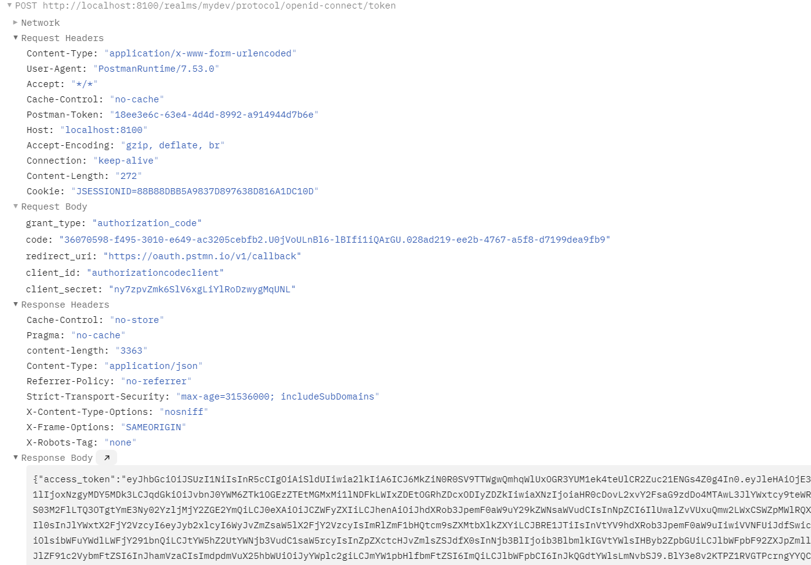
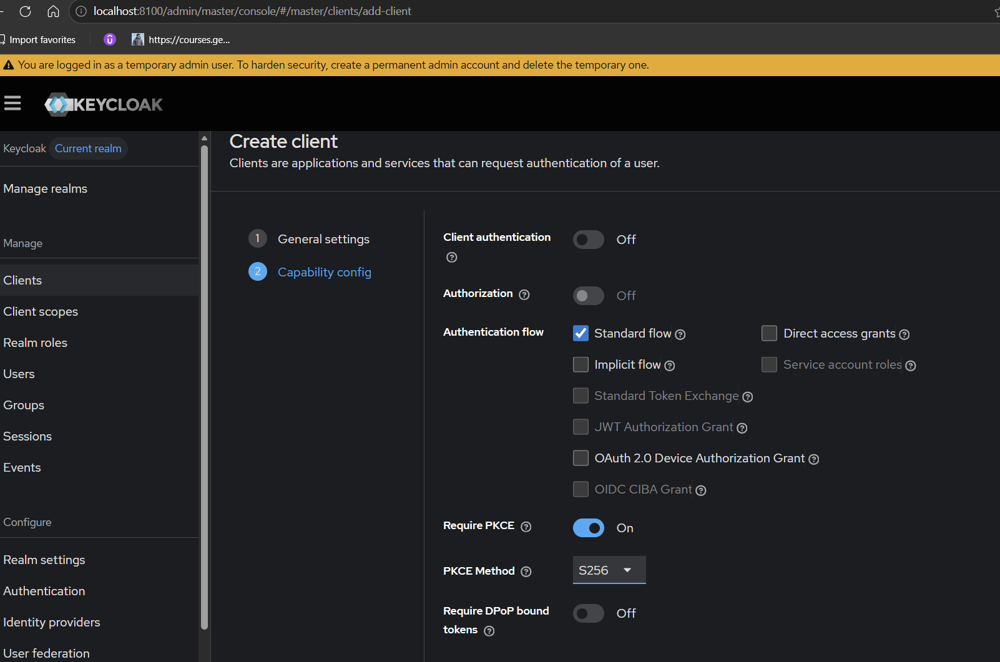
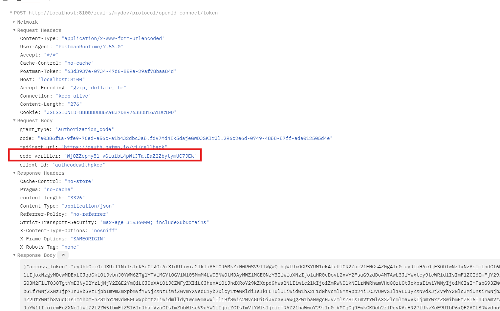

# Spring Security OAuth2 Resource Server with Keycloak

A Spring Boot application demonstrating OAuth2 Resource Server implementation using Spring Security and Keycloak.

The application validates JWT access tokens issued by Keycloak, extracts roles from the token, and converts them into Spring Security authorities for authorization.

---

## Features

- OAuth2 Resource Server
- JWT Authentication
- Keycloak Integration
- Authorization Code Flow
- Authorization Code Flow with PKCE
- JWT Signature Validation
- Role-Based Authorization
- Custom JWT Role Converter
- Method Level Security
- OpenID Connect Discovery

---

## Technologies Used

- Java
- Spring Boot
- Spring Security
- OAuth2 Resource Server
- Keycloak
- JWT
- Docker
- Postman

---

## Architecture

```text
Client
   │
   ▼
Keycloak Authorization Server
   │
   │ Issues JWT Access Token
   ▼
Spring Boot Resource Server
   │
   │ Validates JWT Signature
   │ Extracts Roles
   ▼
Protected APIs
```

---

## Keycloak Setup

Keycloak was started using Docker:

```bash
docker run -p 127.0.0.1:8100:8080 \
-e KC_BOOTSTRAP_ADMIN_USERNAME=admin \
-e KC_BOOTSTRAP_ADMIN_PASSWORD=admin \
quay.io/keycloak/keycloak:26.6.3 start-dev
```

Access Keycloak:

```text
http://localhost:8100
```

---

## Spring Security Configuration

The application is configured as an OAuth2 Resource Server.

```properties
spring.application.name=oauth2resourceserver

spring.security.oauth2.resourceserver.jwt.jwk-set-uri=http://localhost:8100/realms/mydev/protocol/openid-connect/certs
```

Spring Security uses the JWK endpoint exposed by Keycloak to retrieve public keys and validate JWT signatures.

---

## Custom JWT Role Converter

The application contains a custom converter that reads roles from:

```json
{
  "realm_access": {
    "roles": [
      "admin",
      "user"
    ]
  }
}
```

and converts them into Spring Security authorities:

```text
ROLE_admin
ROLE_user
```

---

# Authorization Code Flow

## Step 1 - Create OAuth2 Client in Keycloak



A confidential client is created in Keycloak.

Configuration:

- Client Authentication = ON
- Standard Flow = Enabled
- PKCE = Disabled

This client will be used for the traditional Authorization Code Flow.

---

## Step 2 - Configure OAuth2 in Postman



Postman is configured with:

- Grant Type = Authorization Code
- Auth URL
- Access Token URL
- Client ID
- Client Secret

Clicking **Get New Access Token** starts the OAuth2 flow.

---

## Step 3 - Authenticate with Keycloak



The user is redirected to Keycloak's login page and enters credentials.

After successful authentication, Keycloak generates an Authorization Code.

---

## Step 4 - Internal Authorization Code Exchange



Postman automatically exchanges:

```text
Authorization Code
        ↓
Access Token
```

using:

```text
POST /protocol/openid-connect/token
```

The client secret is included during the exchange.

---

## Step 5 - Access Token Received

Once the exchange succeeds, Keycloak returns a signed JWT Access Token.

This token can now be sent to secured endpoints:

```http
Authorization: Bearer eyJhbGciOi...
```

---

# Authorization Code Flow with PKCE

PKCE (Proof Key for Code Exchange) protects public clients from authorization code interception attacks.

---

## Step 6 - Create PKCE Client in Keycloak



PKCE Client Configuration:

- Client Authentication = OFF
- Standard Flow = Enabled
- Require PKCE = ON
- PKCE Method = S256

Since the client is public, no client secret is required.

---

## Step 7 - Configure PKCE in Postman


Postman is configured with:

- Grant Type = Authorization Code (With PKCE)
- Code Challenge Method = SHA-256
- Client ID
- Authorization Endpoint
- Token Endpoint

Postman automatically generates:

```text
Code Verifier
Code Challenge
```

---

## Step 8 - Code Verifier Validation



During token exchange, Postman sends:

```text
Authorization Code
+
Code Verifier
```

Keycloak validates the Code Verifier against the previously generated Code Challenge.

Only if validation succeeds will Keycloak issue an Access Token.

This prevents attackers from reusing intercepted Authorization Codes.

---

# OpenID Connect Discovery Endpoint

## Step 9 - OpenID Configuration

.png)

Keycloak exposes OpenID Connect metadata through:

```text
http://localhost:8100/realms/mydev/.well-known/openid-configuration
```

This endpoint provides:

- Authorization Endpoint
- Token Endpoint
- JWK Endpoint
- UserInfo Endpoint
- Logout Endpoint
- Supported Grant Types

Example:

```text
authorization_endpoint
token_endpoint
jwks_uri
userinfo_endpoint
```

Applications can use this endpoint to dynamically discover Keycloak configuration.

---

## Testing Secured APIs

Example protected endpoint:

```text
GET /secured/admin
```

Request:

```http
GET /secured/admin
Authorization: Bearer <access-token>
```

Spring Security:

1. Validates JWT signature.
2. Reads token claims.
3. Extracts roles.
4. Converts roles into authorities.
5. Authorizes the request.

---

## Project Structure

```text
src/main/java
│
├── SecurityConfig.java
└── JwtToRoleConverter.java
```

### SecurityConfig

Responsible for:

- OAuth2 Resource Server configuration
- JWT validation
- Endpoint security
- Method security
- Registering custom JWT converter

### JwtToRoleConverter

Responsible for:

- Reading Keycloak realm roles
- Converting roles to Spring Security authorities
- Supporting role-based authorization

---

## Learning Outcomes

This project demonstrates:

- OAuth2 Fundamentals
- JWT Authentication
- OAuth2 Resource Server
- Keycloak Integration
- Authorization Code Flow
- Authorization Code Flow with PKCE
- OpenID Connect Discovery
- JWT Signature Validation
- JWK Set Usage
- Spring Security Authorization
- Role-Based Access Control (RBAC)
